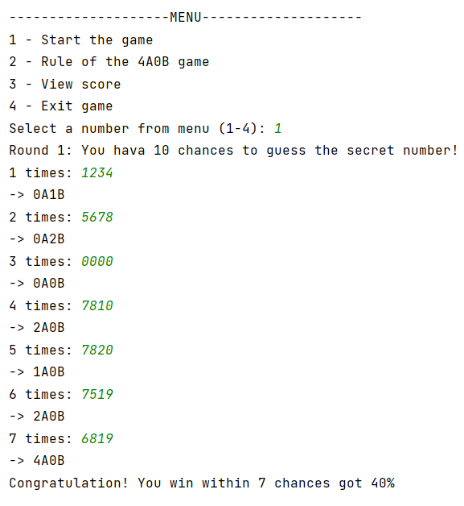
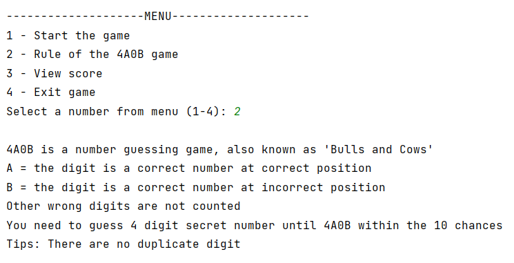
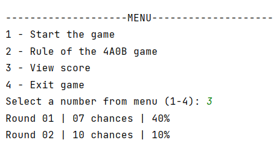
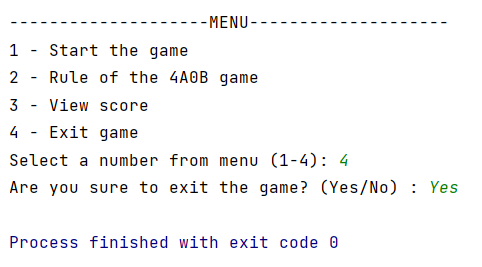
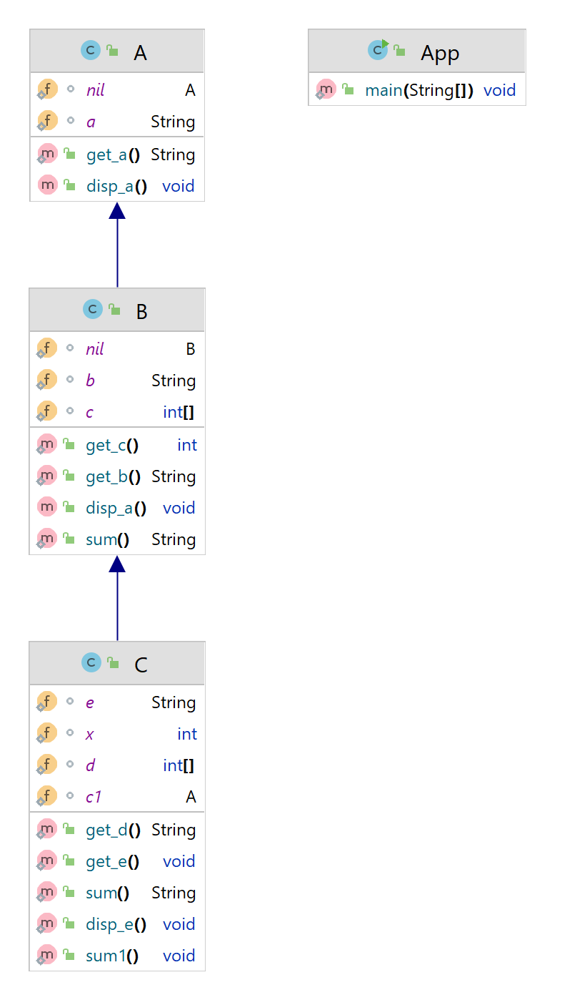

## Requirements for Assignment-1

[Read the instruction](https://github.com/STIW3054-A221/class-activity-soc/blob/main/Assignment-1.md)

## Your Info:

|                         My Photo                         | My Info                                                                                                                                                                                                                                                                                                                                                                                                                                                                                                                                                                                                                                                                                                                                                |
|:--------------------------------------------------------:|--------------------------------------------------------------------------------------------------------------------------------------------------------------------------------------------------------------------------------------------------------------------------------------------------------------------------------------------------------------------------------------------------------------------------------------------------------------------------------------------------------------------------------------------------------------------------------------------------------------------------------------------------------------------------------------------------------------------------------------------------------|
|  | Hello 👋🏻   I'm **H'ng Zi Ling**, matric number **281895**      ⇨ 23 years old ⇨ School of Computing, Universiti Utara Malaysia ⇨ Bachelor of Science with Honours (Information Technology) ⇨ Majoring in Software Engineering  ⇨ Semester 5 (A221)   You can contact me at     |

## Introduction

This program is a number guessing game called 4A0B, also known as "Bulls and Cows". 
After choosing to start the game, the system will automatically randomly generate 4 non-repeating numbers, and the
player needs to guess the secret number
within 10 chances. When the number is correct and the position is correct, calculated as A, if the position is
incorrect, calculated as B, and the others will not be counted.
The system will display the result XAXB as a hint according to each guess of the player, and the player can guess the
secret number through their reasoning ability.  

At the beginning, the system will display a menu for player to choose, and there are 4 options in it, namely
1. **Start the game** 
   Player start guessing numbers until the result is 4A0B or 10 chances are used up. 
2. **Rule of the 4A0b game** 
   Player can view the game rules. 
3. **View Score** 
   Player can play 10 rounds of the game. The chances and final scores for each round will be displayed here. 
4. **Exit game** 
   Confirm whether player want to exit, if player choose "No", return to the menu. 

## Result/Output (Screenshot of the output)

**Output Option 1** - Start the game 
  
**Output Option 2** - Rule of the 4A0b game 
  
**Output Option 3** - View score 
  
**Output Option 4** - Exit game 
  

## UML Class Diagram

## Youtube Presentation

https://youtu.be/TYAiTGrbqXw

## References (Not less than 10)

Asghar, A. (2022). _How to Print an Array in Java._ Linux Hint. https://linuxhint.com/print-array-java/

Baeldung. (2022, September 2022). _Generating random numbers in Java._
Baeldung. https://www.baeldung.com/java-generating-random-numbers

Divertitto, A. (2022, February 8). _Java extends keyword with examples._
CodeGym. https://codegym.cc/groups/posts/java-extends-keyword-with-examples

_How to check if a string is numeric in Java?_ (n.d.).
CodeAhoy. https://codeahoy.com/q/11/check-if-a-string-is-numeric-in-java#accepted-answer

Irfan, M. (2022, January 4). _Ignore upper case and lower case in Java._
DelftStack. https://www.delftstack.com/howto/java/ignorecase-of-string-in-java/

_Java static keyword._ (n.d.). JavaTpoint. https://www.javatpoint.com/static-keyword-in-java

_Java switch statement._ (n.d.). Programiz. https://www.programiz.com/java-programming/switch-statement

Liao, S. (2022, February 14). _How to play bulls and cows with Python._ Dev
Genius. https://blog.devgenius.io/how-to-play-bulls-and-cows-with-python-5b9d2ae95ba4

Mandliya, A. (n.d.). _How to end program in Java._ Java2Blog. https://java2blog.com/how-to-end-program-java/

Sakpal, T. (2018, April 10). _Multi-level inheritance in Java with program example._ Simple
Snippets. https://simplesnippets.tech/multi-level-inheritance-in-java-with-program-example/

Simplilearn. (2021, September 13). _Understanding for loop in Java with examples and syntax._
Simplilearn. https://www.simplilearn.com/tutorials/java-tutorial/for-loop-in-java

Singh, C. (n.d.). _do-while loop in Java with example._
BeginnersBook. https://beginnersbook.com/2015/03/do-while-loop-in-java-with-example/

## JavaDoc

[Open JavaDoc in Browser](https://hngziling.github.io/JavaDoc/my/uum/package-summary.html)

[Open the JavaDoc File](https://github.com/STIW3054-A221/assignment-1-HngZiLing/blob/404521c5a7b57ac75232551c1a7deb0a253a1884/JavaDoc)
