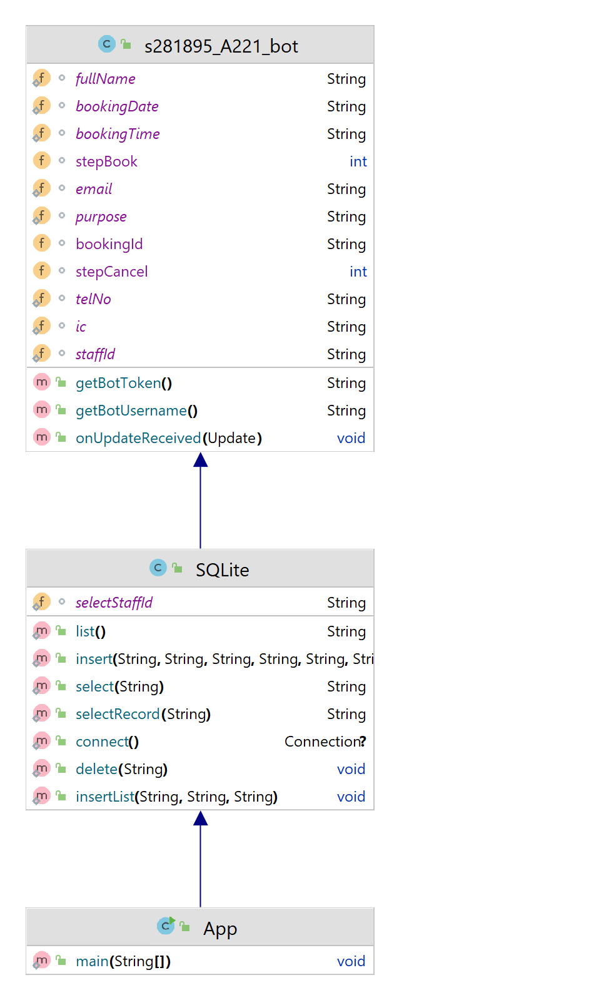

## Introduction

TelegramBot is a robot that can reply automatically. In this assignment, **s281895_A221_bot** is a robot that can
provide service about the meeting room. It will receive the information of staffs who want to book a meeting room and
save it to the database. It can also cancel the booked meeting room through the staff id, and it can also display the
user list.

This telegram bot has 4 menu options, which are

|  Option  | Function                                                                                                                                                                                                                                             |
|:--------:|:-----------------------------------------------------------------------------------------------------------------------------------------------------------------------------------------------------------------------------------------------------|
|  /start  | Display welcome message and some option about the meeting room                                                                                                                                                                                       |
| /booking | Telegram bot will ask 8 info about the user to book a meeting room, which are : 1. IC Number 2. Staff ID 3. Name 4. Telephone No 5. Email Address 6. Purpose of booking meeting room 7. Booking Date 8. Booking Time |
| /cancel  | User can cancel the booking record by using their staff ID                                                                                                                                                                                           |
| /display | Telegram bot will retrieve the booking record from the database and display it to the user. The info displayed include the 8 info entered by the user and also 1. Room ID 2. Room description 3. Room maximum capacity                   |

By using this s281895_A221_bot to booking meeting room, it will be more convenient and simple. There are no manual
application and will be easier to refer manage.

## Flow Diagram of the requirements (Use: https://app.diagrams.net/)

## UML Class Diagram

## References (Not less than 10)

Beazell, A. (2020, July 20). _Working with auto-increment IDs & primary keys in SQL._
Retool. https://retool.com/blog/how-to-work-with-auto-incrementing-ids-in-sql/

_How to check if String contains only alphabets in Java?_ (n.d.).
TutorialKart. https://www.tutorialkart.com/java/how-to-check-if-string-contains-only-alphabets-in-java/

_Java with SQLite._ (n.d.). Javatpoint. https://www.javatpoint.com/java-sqlite

Ordabekov, A. (2021, November 11). _How to create Telegram Bot in Java._
YouTube. https://www.youtube.com/watch?v=XjOnp8TVNSQ

ProgrammingKnowledge. (2022, February 17). _How to install SQLite on Windows 11 (2022)._
YouTube. https://www.youtube.com/watch?v=BomCx0jbwPY

Smarttek School. (2021, March 22). _Telegram Bot Yaratish va Avtomatizatsiya Qilish (IT Sohasi)._
YouTube. https://www.youtube.com/watch?v=VfpC_BEgMVk

_SQLite._ (2022, December 7). IntelliJ IDEA. https://www.jetbrains.com/help/idea/sqlite.html

_SQLite Inner Join._ (n.d.). SQLite Tutorial. https://www.sqlitetutorial.net/sqlite-inner-join/

_SQLite - Java._ (n.d.). Tutorialspoint. https://www.tutorialspoint.com/sqlite/sqlite_java.htm

Tech VideoStack. (2019, Ogos 7). _Browse SQLite database on Windows 10._
YouTube. https://www.youtube.com/watch?v=PdRQtl5icp0

Vaghela, V. (2020, December 22). _How to create a Telegram Bot using Java._
Medium. https://vaghelaviral.medium.com/how-to-create-a-telegram-bot-using-java-5710bed16c0f

## JavaDoc

[Open JavaDoc in Browser](https://hngziling.github.io/stiw3054-assignment-2/JavaDoc/my/uum/package-summary.html)

[Open JavaDoc File](https://github.com/STIW3054-A221/assignment-2-HngZiLing/tree/master/JavaDoc)
