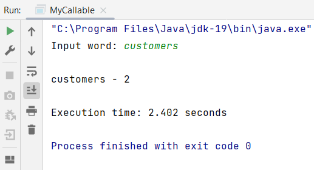

## Instruction:

1. Attached in this repo is the `RossBeresford.txt`. Write a Java program to count and display matching words from the `RossBeresford.txt`. Watch the video below: 
   * [Java IO | How to write & read multiple objects from a file](https://youtu.be/l__bi60QeBU)
   * [Car example | How to add and remove objects from ArrayList in Java](https://youtu.be/lwMjWDk3oFI)

1. Your program should implement `Callable` and `Future` interfaces. Video --> [Java Concurrency | How to implement Callable & Future with ExecutorService](https://youtu.be/oXC8izF1jAI)

1. The word must be input from the keyboard. Video --> [Java | Getting user input using 'Scanner' class](https://youtu.be/laOtr6GYXDg)

1. Calculate the execution time using Apache StopWatch. Video --> [Apache StopWatch | How to calculate Execution Time in Java](https://youtu.be/coEa48WDDno)

1. The program file and the class name which has the main method should be named `MyCallable.java` and place in the `src/main/java/my/uum/` folder.

1. Screenshot the result and upload to this repo too.

1. Watch the video for the configuration: https://youtu.be/h2DT2SsPX1M

1. Watch the video to clone, add, commit and push a repository to GitHub: https://youtu.be/RXV3Yusr0SI

## Example of the output
```
Input word: customers

customers - xx

Execution time: 0.005 seconds
```

## Your Output/Result



