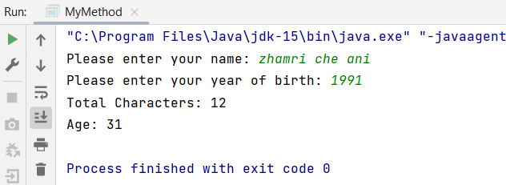

## Your Info:
1. Matric Number : 281895
1. Name : H'ng Zi Ling

## Instruction
1. Do not modify the structure of this repository.
1. All source codes must be uploaded to this GitHub repository.
1. Video --> [IntelliJ IDEA | How to clone, add, commit and push a repository to GitHub easily](https://youtu.be/RXV3Yusr0SI)
1. All images must be included in `images` folder.
1. The screenshot of result/output must be displayed at your `Readme.md`.


## Question-1

Write a Java program which has __TWO(2)__ methods:
1. The first method will count the number of characters of a student's name. If the length of the name is less than 5 characters, then the user MUST input again.
2. The second method will calculate the age based on the year of birth. If the year is greater than 2021, then the user MUST input again.

The Java file MUST be named as `MyMethod.java`.

### Example of the output
```
Please enter your name: zhamri che ani
Please enter your year of birth: 1991
Total Characters: 12
Age: 31
```

### Result/Output (Screenshot of the output)

