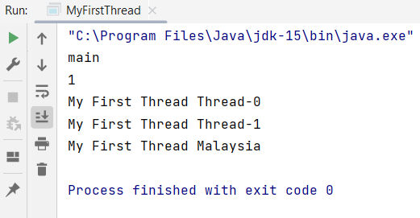

## Instruction:

1. Watch the video below:

   https://youtu.be/FtjwRAYj9C4

2. Rewrite the Java program, then create the 3rd thread and set the thread name as `Malaysia`.
3. Upload the program to this repo. The Java file which has the main method MUST be named `MyFirstThread.java` and
   placed in the `src` folder. Watch the video below for the configuration:

   https://youtu.be/h2DT2SsPX1M

4. Screenshot the result and upload it to this repo too.

## Output/Result

