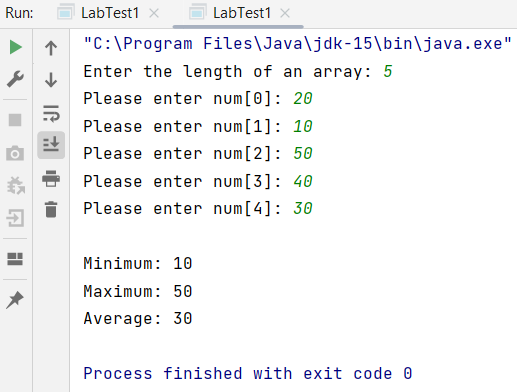

## Your Info:
1. Matric Number: 281895
1. Name: H'ng Zi Ling

## Instruction:

1. This question is about implementing `Java Interface`.

1. Write a Java program which has __THREE(3)__ methods to find the minimum, maximum and average value of several numbers. The program must implement a Java Interface which contains all the methods.
   * The first method will find the minimum number.
   * The second method will find the maximum number.
   * The third method will calculate the average value.

1. All the numbers must be stored in an array and the length of the array will be specified by a user (from keyboard). If the length of the array is less than 5 or more than 7, then the user MUST input again. 

1. The Java file which has the main method MUST be named `LabTest1.java` and place in the `src` folder.

### Example of the output
```
Enter the length of an array: 5
Please enter num[0]: 20
Please enter num[1]: 10
Please enter num[2]: 50
Please enter num[3]: 40
Please enter num[4]: 30

Minimum: 10
Maximum: 50
Average: 30
```


### Result/Output (Screenshot of the output)


