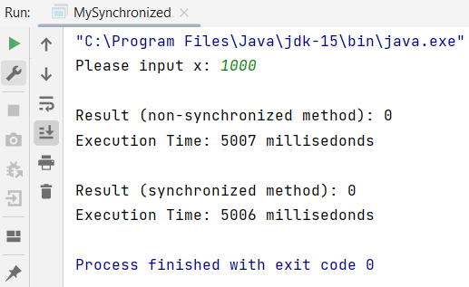

## Instruction:

1. Study the code below:

   https://github.com/zhamri/STIW3054-RT-Programming/blob/master/src/Week_06/TestSynchronizedCounter.java

1. Then write a Java program to start __TWO (2)__ threads where:
    * 1st thread will increment the number by 1 for x times. Create a class called MyIncrement to do this task. 
    * 2nd thread will decrement the number by 1 for x times. Create a class called MyDecrement to do this task.
   
1. x is an integer number and MUST be input from the keyboard.

1. The 1st thread should finish first and follow by the 2nd thread. Then display the result. 

1. Use the Counter class which has the methods for the increment and the decrement.

1. Calculate the execution time using Apache Stopwatch. Video --> https://youtu.be/coEa48WDDno

1. Then compare the results between synchronized and non-synchronized methods for the increment and the decrement.

1. The program file which has the main method should be named `MySynchronized.java` and place in the `src/main/java/my/uum/` folder.

1. Screenshot the result and upload to this repo too.

1. Watch the video for the configuration: https://youtu.be/h2DT2SsPX1M

1. Watch the video to clone, add, commit and push a repository to GitHub: https://youtu.be/RXV3Yusr0SI

## Example of the output
```
Please input x: 1000

Result (non-synchronized method): xxx
Execution Time: xxx millisedonds

Result (synchronized method): xxx
Execution Time: xxx millisedonds
```

## Your Output/Result



