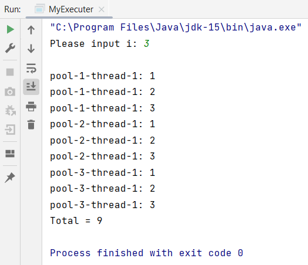

## Your Info:
1. Matric Number: 281895
1. Name: H'ng Zi Ling

## Instruction:

1. Study the code below:

   https://github.com/zhamri/STIW3054-RT-Programming/blob/master/src/Week_06/TestSynchronized2s1.java  

1. Modify the code by applying ExecuterService with SingleThreadExecuter. Video --> [Java Thread | 3 ways to implement ExecuterService with SingleThreadExecuter Example](https://youtu.be/P6Ytrr3CG9M)

1. The variable `i` is integer number and MUST be input from the keyboard. Video --> [Java | Getting user input using 'Scanner' class](https://youtu.be/laOtr6GYXDg)

1. The program file which has the main method should be named `MyExecuter.java` and place in the `src/main/java/my/uum/` folder.

1. Screenshot the result and upload to this repo too.

1. Watch the video for the configuration: https://youtu.be/h2DT2SsPX1M

1. Watch the video to clone, add, commit and push a repository to GitHub: https://youtu.be/RXV3Yusr0SI

## Example of the output
```
Please input i: 3

pool-1-thread-1: 1
pool-3-thread-1: 1
pool-3-thread-1: 2
pool-3-thread-1: 3
pool-2-thread-1: 1
pool-2-thread-1: 2
pool-2-thread-1: 3
pool-1-thread-1: 2
pool-1-thread-1: 3
Total = 9
```

## Your Output/Result

